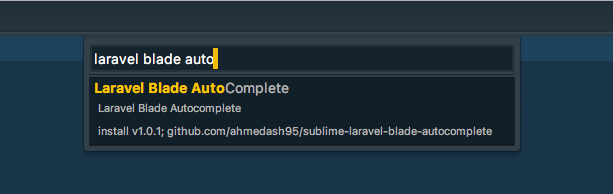
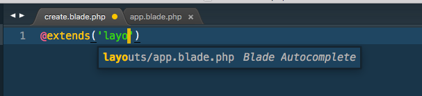
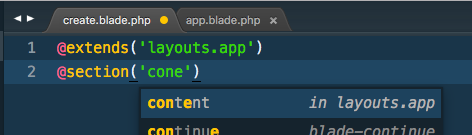
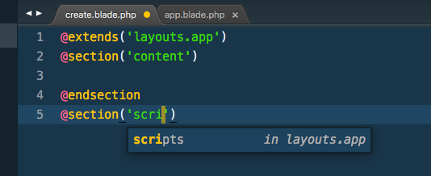

Laravel Blade Autocomplete for Sublime Text 3
=============

Sublime Text Autocomplete plugin for Laravel Blade Files

## How to install

## Usage

### @extends autocomplete example

### @section autocomplete example

### Credits
Created By [Ahmed Ashraf](https://github.com/ahmedash95)
